<div align="center">

<br/>


### AI-Enhanced Exam Cell Management System

*Automating invigilation · scheduling · seating — end to end*

<br/>


</div>

---

## 🎯 Overview

**InExa** (Intelligent Examination Administration) is a full-stack MERN web application designed to eliminate the manual burden of academic examination management. It replaces paper-based workflows with intelligent, automated processes — from distributing invigilation duties fairly across faculty to generating seating plans that prevent malpractice.

> Developed as a B.Tech mini-project at **Vidya Academy of Science and Technology**, Thrissur, under **APJ Abdul Kalam Technological University** — March 2026.

---

## ✨ Features

| Module | Description |
|--------|-------------|
| 🤖 **AI Duty Allocation** | Round-Robin Mixed Designation (RRMD) algorithm distributes invigilation duties fairly across designation groups |
| 🪑 **Auto Seating** | Interleaves students from different departments to prevent clustering; respects hall capacity |
| 📅 **Exam Scheduling** | Create, edit, and manage exam slots with conflict detection |
| 🔄 **Leave Adjustment** | Faculty submit leave requests; admin approves and auto-reassigns duties |
| 📊 **Reports** | Export invigilation schedules and seating plans as Excel or PDF |
| 🔐 **Role-Based Access** | Separate dashboards and permissions for Admin, Faculty, and Students |
| 📱 **Student Portal** | Students instantly look up their seat number, hall, and timetable |
| 📂 **Excel Import** | Bulk-upload faculty records via `.xlsx` with upsert logic |

---

## 🛠 Tech Stack

```
┌──────────────────────────────────────────────────┐
│                  FRONTEND                        │
│   React.js  ·  Tailwind CSS  ·  React Router    │
│   Axios  ·  React Hooks                         │
├──────────────────────────────────────────────────┤
│                  BACKEND                         │
│   Node.js  ·  Express.js  ·  JWT  ·  bcrypt     │
│   Multer  ·  XLSX  ·  CORS                      │
├──────────────────────────────────────────────────┤
│                  DATABASE                        │
│   MongoDB  ·  Mongoose ODM                      │
└──────────────────────────────────────────────────┘
```

---

## 🏗 System Architecture

```
                        ┌─────────────────────┐
                        │    React Frontend    │
                        │  (Tailwind CSS UI)   │
                        └──────────┬──────────┘
                                   │ HTTP / Axios
                        ┌──────────▼──────────┐
                        │   Express.js API    │
                        │  ┌───────────────┐  │
                        │  │  JWT Middleware│  │
                        │  │  RBAC Layer   │  │
                        │  └───────────────┘  │
                        │  ┌───────────────┐  │
                        │  │  RRMD Engine  │  │
                        │  │  Seat Engine  │  │
                        │  └───────────────┘  │
                        └──────────┬──────────┘
                                   │ Mongoose
                        ┌──────────▼──────────┐
                        │      MongoDB        │
                        │  faculty · slots    │
                        │  students · halls   │
                        │  duties · leaves    │
                        └─────────────────────┘
```

---

## 🚀 Getting Started

### Prerequisites

- Node.js `v18+`
- MongoDB `v6+` (local or Atlas)
- npm `v9+`

### 1. Clone the Repository

```bash
git clone https://github.com/your-org/inexa.git
cd inexa
```

### 2. Install Dependencies

```bash
# Backend
cd server
npm install

# Frontend
cd ../client
npm install
```

### 3. Configure Environment Variables

```bash
cp server/.env.example server/.env
# Edit server/.env with your values (see below)
```

### 4. Run the Application

```bash
# Start backend (from /server)
npm run dev

# Start frontend (from /client)
npm start
```

The app will be available at `http://localhost:3000` and the API at `http://localhost:5000`.

---

## 🔑 Environment Variables

Create a `.env` file in the `/server` directory:

```env
# Server
PORT=5000
NODE_ENV=development

# MongoDB
MONGO_URI=mongodb://localhost:27017/inexa

# JWT
JWT_SECRET=your_super_secret_key_here
JWT_EXPIRES_IN=7d

# CORS
CLIENT_URL=http://localhost:3000
```

---


## 🧠 Core Algorithm: RRMD

The **Round-Robin Mixed Designation (RRMD)** algorithm is the heart of InExa's duty allocation:

```
1.  Load all faculty from MongoDB
2.  Group faculty by designation:
      → Professor  →  Associate Professor
      → Assistant Professor  →  Lab Staff
3.  Within each group, sort by ascending duty count
4.  Rotate cyclically across groups to pick invigilators
5.  For each selected faculty, apply constraints:
      ✗  Already assigned on the same date?  → Skip
      ✗  Violates Saturday rule?             → Skip
      ✓  Assign to slot
6.  Atomically update duty counts in MongoDB (BulkWrite)
7.  Repeat until all slots are filled
```

This guarantees **near-zero standard deviation** in workload distribution across all faculty, regardless of institution size.

---
## Project Screenshots

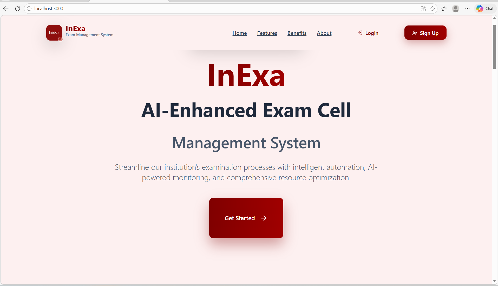

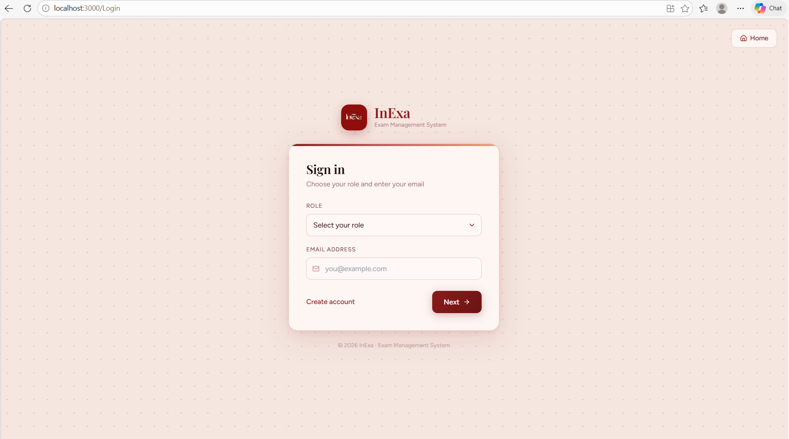

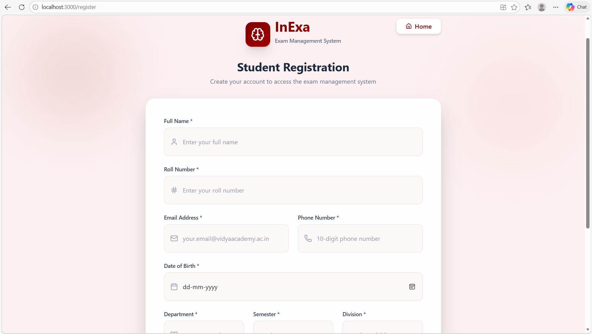

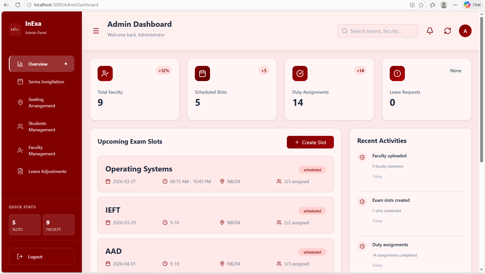

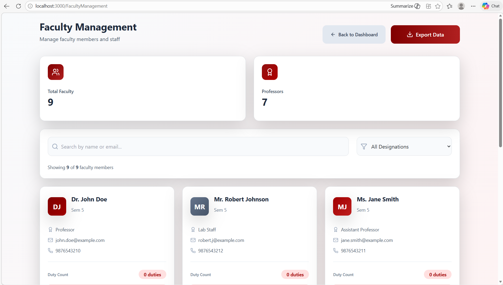

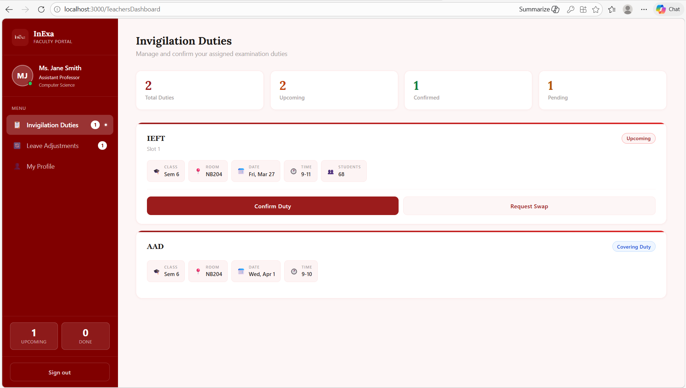

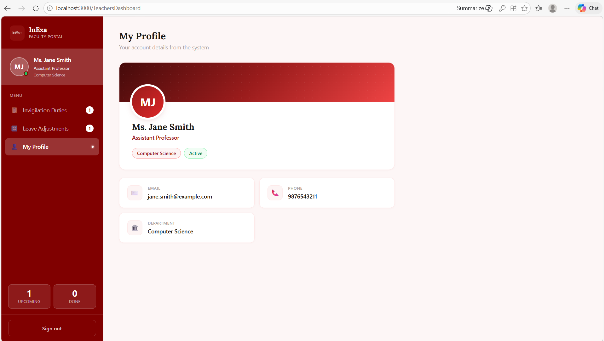

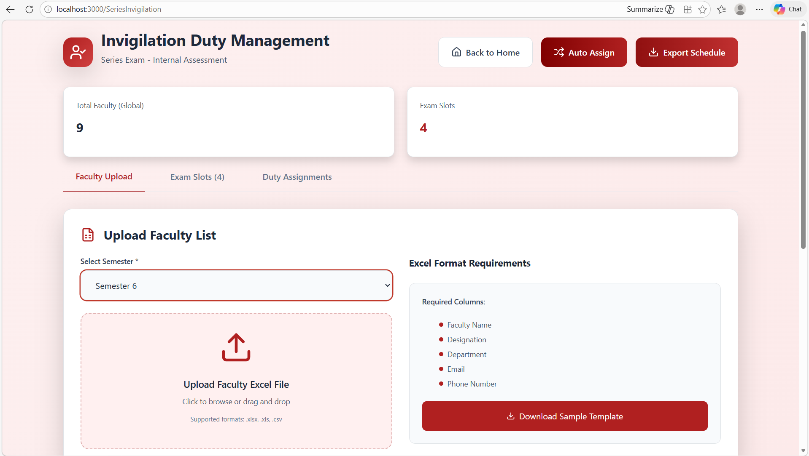

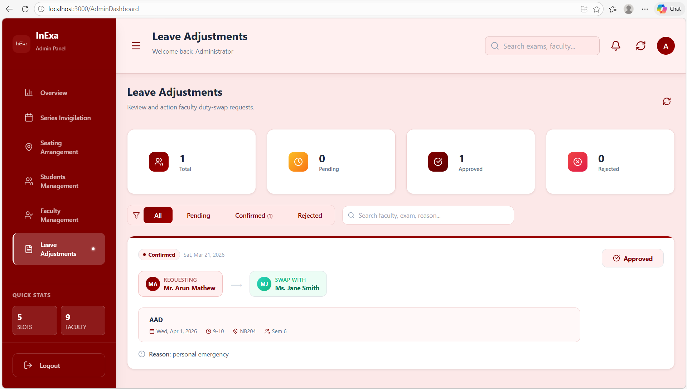

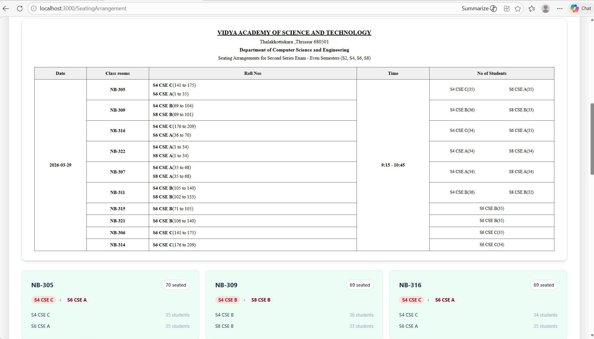

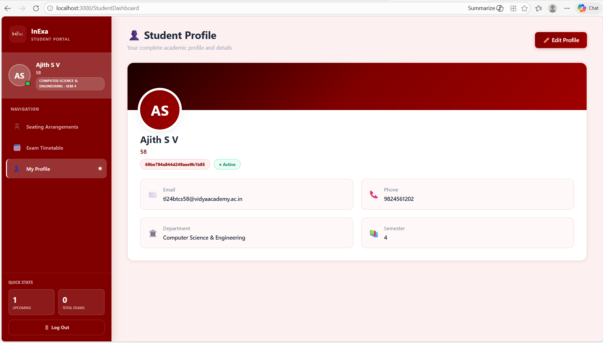

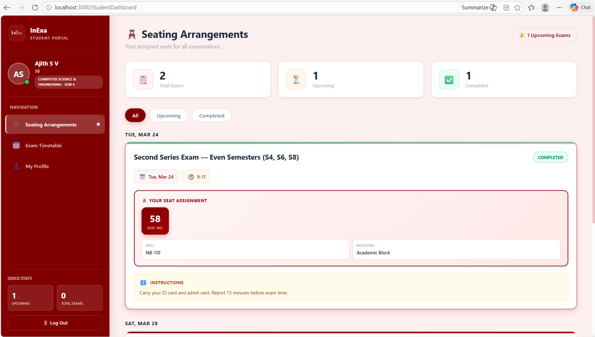


## 👥 User Roles

### 🔴 Admin (Exam Cell Coordinator)
- Full access to all modules
- Upload faculty data via Excel
- Trigger AI auto-assignment
- Generate and export seating plans
- Approve/reject leave requests
- View all reports

### 🟡 Faculty
- View personal invigilation schedule
- Confirm duty attendance
- Submit leave adjustment requests
- Request duty swaps

### 🟢 Student
- View assigned seat number and hall
- View exam timetable
- Print seat slip

---

## 📈 Performance

Results from pilot deployment:

| Metric | Manual Process | InExa | Improvement |
|--------|---------------|-------|-------------|
| Duty allocation time | ~3–4 hours | < 10 seconds | **~99%** |
| Seating plan generation | ~2 hours | < 5 seconds | **~99%** |
| Scheduling conflicts | Frequent | Zero | ✅ |
| Faculty duty imbalance | High | Near-zero | ✅ |
| Leave request resolution | 1–2 days | < 1 hour | **~90%** |
| Student seat lookup | Manual | Instant | ✅ |

---

## 🌍 SDG Alignment

InExa contributes to the following United Nations Sustainable Development Goals:

- 🎓 **SDG 4 — Quality Education**: Equitable, transparent examination access for all students and faculty
- 🏗 **SDG 9 — Industry, Innovation & Infrastructure**: Scalable digital infrastructure for academic institutions
- ⚖️ **SDG 16 — Peace, Justice & Strong Institutions**: Accountable, auditable governance of examination processes

---


## 📄 License

This project is licensed under the MIT License. See the [LICENSE](LICENSE) file for details.

---

<div align="center">

Made with ❤️ at **Vidya Academy of Science and Technology**

*InExa — Intelligent Examination Administration*

</div>
